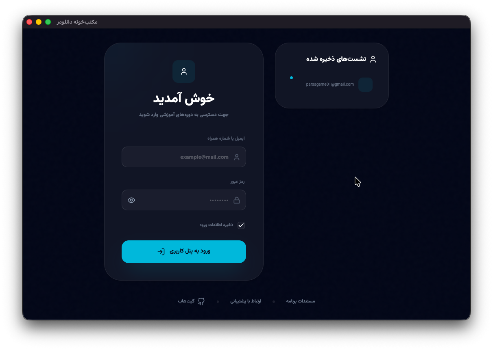
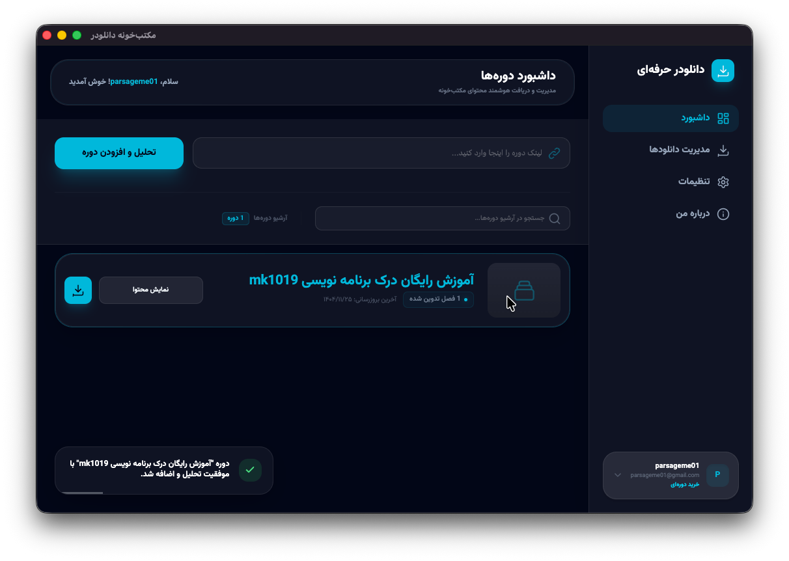
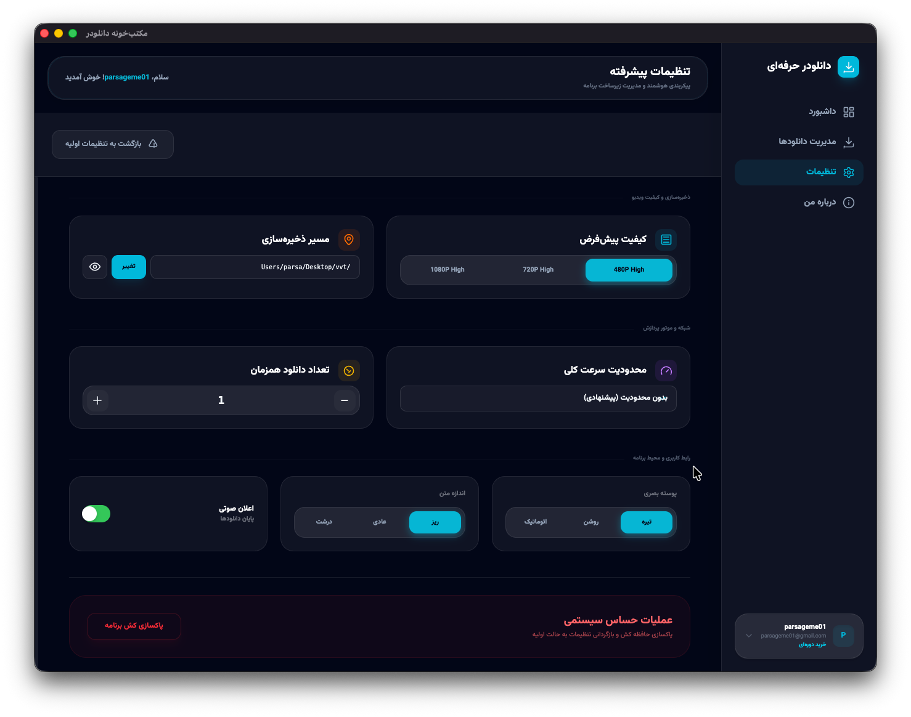

<div align="center">


# مکتب‌خونه دانلودر

**ابزار حرفه‌ای دانلود محتوای آموزشی [مکتب‌خونه](https://maktabkhooneh.org/)**

[](LICENSE)
[](#نصب)
[](https://www.electronjs.org/)

</div>

---

## 📖 درباره پروژه

مکتب‌خونه دانلودر یک اپلیکیشن دسکتاپ کراس‌پلتفرم است که با **Electron** ساخته شده و امکان دانلود یکجا و سازمان‌یافته محتوای دوره‌های سایت مکتب‌خونه را فراهم می‌کند.

> ⚠️ **توجه:** فقط محتوایی را می‌توانید دانلود کنید که **قانوناً** به آن دسترسی دارید.

### ✨ قابلیت‌ها

- 🔐 **ورود امن** — احراز هویت مستقیم با حساب مکتب‌خونه
- 👥 **مولتی‌اکانت** — مدیریت و سوئیچ بین چندین حساب کاربری
- 📚 **دانلود هوشمند** — ویدیوها، زیرنویس‌ها و فایل‌های ضمیمه
- ⏸️ **ادامه دانلود** — Resume پس از قطعی اینترنت یا بستن برنامه
- 🔄 **ورود مجدد خودکار** — تمدید خودکار نشست کاربری
- 📊 **مانیتورینگ پیشرفته** — نمایش سرعت، پیشرفت و زمان باقیمانده
- 🎨 **رابط کاربری حرفه‌ای** — طراحی RTL با تم روشن و تاریک
- ⚙️ **تنظیمات پیشرفته** — انتخاب کیفیت، مسیر ذخیره، تعداد دانلود همزمان

---

## 🖼️ تصاویر

<div align="center">

| ورود به حساب | داشبورد دوره‌ها |
|:---:|:---:|
|  |  |

| مدیریت دانلودها | پیشرفت دانلود |
|:---:|:---:|
|  |  |

| تنظیمات |
|:---:|
|  |

</div>

---

## 🚀 نصب

### دانلود نسخه آماده

از بخش [**Releases**](../../releases/latest) آخرین نسخه متناسب با سیستم‌عامل خود را دانلود کنید:

| سیستم‌عامل | معماری | فرمت |
|:---:|:---:|:---:|
| **Windows** | x64 / arm64 | `.exe` (NSIS Installer) |
| **macOS** | Intel / Apple Silicon (Universal) | `.dmg` |
| **Linux** | x64 / arm64 | `.AppImage`, `.deb` |

### ساخت از سورس

#### پیش‌نیازها
- [Node.js](https://nodejs.org/) نسخه ۱۸ یا بالاتر
- npm (همراه با Node.js نصب می‌شود)

#### مراحل

```bash
# کلون پروژه
git clone https://github.com/<your-username>/maktabkhooneh-downloader.git
cd maktabkhooneh-downloader

# نصب وابستگی‌ها
npm install

# اجرا در حالت توسعه
npm run dev

# ساخت بسته نصبی (برای سیستم‌عامل فعلی)
npm run package

# ساخت برای تمام پلتفرم‌ها
npm run package:all
```

---

## 🏗️ ساختار پروژه

```
maktabkhooneh-downloader/
├── build/                  # آیکون‌ها و منابع ساخت
├── src/
│   ├── main/               # فرآیند اصلی Electron
│   │   ├── index.mjs       # مدیریت پنجره و IPC
│   │   └── downloader.mjs  # موتور دانلود
│   ├── preload/
│   │   └── index.mjs       # پل ارتباطی امن
│   └── renderer/
│       ├── index.html       # صفحه اصلی
│       ├── src/main.js      # رابط کاربری
│       └── assets/          # فونت‌ها و استایل‌ها
├── Screenshot/             # تصاویر برنامه
├── package.json
└── electron.vite.config.mjs
```

---

## 🛠️ تکنولوژی‌ها

| تکنولوژی | کاربرد |
|:---|:---|
| **Electron** | فریمورک دسکتاپ کراس‌پلتفرم |
| **electron-vite** | بیلد سیستم سریع |
| **Tailwind CSS v4** | استایل‌دهی مدرن |
| **Node.js https** | موتور دانلود بومی |
| **electron-builder** | بسته‌بندی و توزیع |

---

## 📝 مجوز

این پروژه تحت مجوز [GPL-3.0](LICENSE) منتشر شده است.

---

## 👨‍💻 توسعه‌دهنده

ساخته شده با ❤️ توسط **VeilVulp**

---

<div align="center">

**اگر این پروژه برایتان مفید بود، یک ⭐ بزنید!**

</div>
